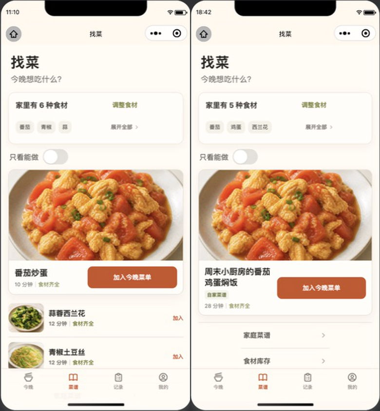
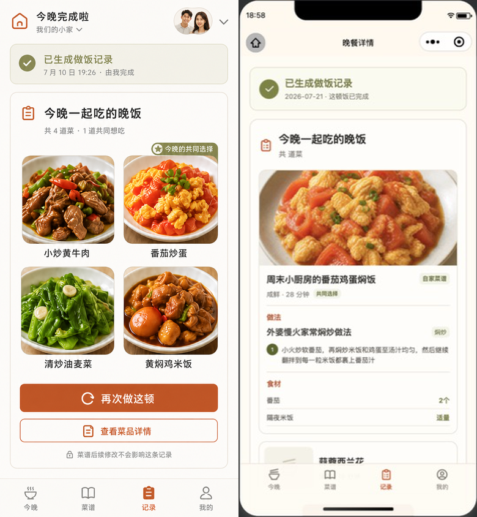

# 家庭菜谱晚餐链路原生 QA 报告

- 日期：2026-07-22
- 范围：`找菜` → `今晚菜单` → `晚餐详情`
- 环境：微信开发者工具 Stable `2.01.2510290`，基础库 `3.16.2`
- 结论：通过。两个原生可见的 P2 已修复并复验；独立审查未发现遗留 P0、P1、P2 或 P3。

## 1. 审核目标与范围

本轮确认家庭已发布菜谱能够在找菜页被识别、加入今晚菜单，并在晚餐完成后以不可变详情展示做法与食材；同时检查 375、390、430 三档宽度下的信息层级、换行、操作区域和底部导航是否稳定。

审核覆盖：

1. 找菜页的库存摘要、家庭菜谱标识、长菜名和加入菜单入口。
2. 草稿态今晚菜单中的家庭菜谱来源、做法摘要、成员意愿和确认操作。
3. 已完成晚餐记录中的家庭菜谱版本快照、做法步骤、食材用量及旧系统菜的兼容展示。

本报告不声称完成全量无障碍合规验证；截图只能支持可见重排、裁切、层级与触控区域检查，不能替代读屏、焦点顺序、动态字号、真机性能或真实网络异常测试。

## 2. 原生环境与捕获规格

| 项目          | 结果                                                          |
| ------------- | ------------------------------------------------------------- |
| 渲染环境      | 微信开发者工具 Stable `2.01.2510290`                          |
| 小程序基础库  | `3.16.2`                                                      |
| 精确视口      | `375 × 812`、`390 × 844`、`430 × 932`                         |
| 控制台        | `Errors = 0`                                                  |
| Problems 面板 | `Problems = 0`                                                |
| 非阻断提示    | 仅见 4–7 条平台弃用或热重载相关 warning，不属于本链路功能错误 |

原始证据来自微信开发者工具原生模拟器。最终文件只做机械裁切/缩放，以得到上述精确像素尺寸；没有重绘或替换页面内容。全部 9 张页面截图与 3 张 390 对比图均已逐张打开检查，文件尺寸与页面状态正确。

## 3. 测试数据夹具

### 3.1 找菜

- 家庭：`我们一起慢慢吃饭的小厨房`，2 人。
- 库存：5 种食材；首屏显示 `番茄`、`鸡蛋`、`西兰花`。
- 家庭精选菜谱：`周末小厨房的番茄鸡蛋焖饭`，用于验证长标题、家庭菜谱标签及加入今晚菜单入口。
- 同一数据集中保留系统菜谱行，用于验证家庭菜谱与系统菜谱能够共存。

### 3.2 今晚菜单

- 菜单状态：`DRAFT`。
- 家庭菜：scope=`HOUSEHOLD`，recipeVersion=`8`，做法名 `外婆慢火家常焖炒做法`，烹饪方式 `焖炒`，意愿来源 `BOTH`。
- 系统菜：`蒜蓉西兰花`，意愿来源 `ME`，无家庭做法字段。
- 用于验证长家庭上下文、成员意愿、来源差异和确认菜单主操作。

### 3.3 晚餐详情

- 记录：`91`，已完成。
- 家庭菜包含长菜名、长做法名和会换行的步骤；食材为 `番茄 2个`、`隔夜米饭 适量`。
- 同一记录包含旧系统菜，method 为 `null`、ingredients 为空，用于验证旧数据不会渲染空的“做法”或“食材”标题。

这些夹具仅用于原生小程序视觉与交互状态复验，不等同于真实 API 菜谱发布、内容审核、生产数据或线上链路证据。

## 4. 流程步骤与截图证据

### 步骤 1：找菜 — 健康

家庭精选卡片保持原有暖白、橄榄绿和橙色层级；5 种库存摘要与首屏 3 个食材标签一致。长家庭菜名在窄屏稳定换为两行，未挤压 `加入今晚菜单` 主操作，卡片与底部导航均无横向溢出。

| 375 × 812                    | 390 × 844                    | 430 × 932                    |
| ---------------------------- | ---------------------------- | ---------------------------- |
|  |  |  |

### 步骤 2：今晚菜单 — 健康

家庭菜和系统菜在同一草稿菜单内保持清楚的来源与意愿区分；长家庭名、菜名、做法摘要和成员文案在三档宽度下没有裁切。`加一道菜` 与 `确认今晚菜单` 的层级明确，主操作区域不小于 88rpx。

| 375 × 812                        | 390 × 844                        | 430 × 932                        |
| -------------------------------- | -------------------------------- | -------------------------------- |
|  |  |  |

### 步骤 3：晚餐详情 — 健康

完成状态、家庭菜谱标签、版本化做法、步骤和食材用量均可见；长步骤会自然换行，`2个` 与 `适量` 未被裁切。旧系统菜卡片继续出现，但不会产生空的做法或食材分区。

| 375 × 812                              | 390 × 844                              | 430 × 932                              |
| -------------------------------------- | -------------------------------------- | -------------------------------------- |
|  |  |  |

说明：旧系统菜卡片在当前截图底部只部分进入视口；其空标题不渲染同时由页面 WXML 条件和自动化测试覆盖，不能仅凭这组局部可见截图作完整视觉证明。

## 5. 390 参考图对比

| 流程     | 既有参考图                                                                             | 390 对比图（左：参考；右：本次实现）                   |
| -------- | -------------------------------------------------------------------------------------- | ------------------------------------------------------ |
| 找菜     | [`docs/design/qa/recipes-390.png`](../recipes-390.png)                                 |            |
| 今晚菜单 | [`docs/design/tonight-menu-draft-baseline.png`](../../tonight-menu-draft-baseline.png) |        |
| 晚餐详情 | [`docs/design/cooking-record-detail.png`](../../cooking-record-detail.png)             |  |

参考图与本次实现使用了不同的数据状态：找菜的库存数量与列表内容不同，今晚菜单的菜品数量不同，晚餐详情分别展示概览态与单菜详情态。因此这些对比只能证明暖白背景、橄榄绿/橙色语义、卡片层级、导航与主要操作的设计方向得到延续，不能作为逐像素一致或严格间距一致的证据。

## 6. 发现、修复与复验

| 严重度 | 原生发现                                                                                                       | 修复                                                                                         | 复验结果                                                               |
| ------ | -------------------------------------------------------------------------------------------------------------- | -------------------------------------------------------------------------------------------- | ---------------------------------------------------------------------- |
| P2     | 家庭精选长菜名被单行截断，影响菜谱识别。                                                                       | `716f072` 将菜名改为最多两行、允许任意断行，并固定标签与主操作不收缩。                       | 375/390/430 均完整呈现两行菜名，按钮尺寸与卡片边界稳定。               |
| P2     | 摘要显示“家里有 5 种食材”，但模板直接读取 `visibleIngredients.length` 时原生页面未渲染食材标签，形成矛盾空态。 | `b80d6f8` 增加并同步显式布尔标量 `hasVisibleIngredients`，模板只依赖该稳定标量控制摘要区域。 | 三档视口均显示 5 种摘要和 3 个首屏食材标签；空库存时标量恢复为 false。 |

两项修复完成后重新捕获全部三类页面、三档视口，并交由独立审查复核。最终没有遗留 P0、P1、P2 或 P3；可见的长文本、操作区域、卡片边界和底部导航均未出现裁切或溢出。

## 7. 自动化与后端证据

| 范围                       | 结果                                                        |
| -------------------------- | ----------------------------------------------------------- |
| 小程序自动化               | 34 suites / 343 tests，通过                                 |
| 小程序静态门禁             | typecheck、lint、format check、`git diff --check`，全部通过 |
| 后端完整回归               | 438 tests，通过                                             |
| MySQL 8 迁移专项           | 1 / 1，通过                                                 |
| MySQL 8 家庭菜谱端到端专项 | 6 / 6，通过                                                 |

MySQL 专项使用一次性、仅回环地址可访问的本地 MySQL 8 环境；没有连接或迁移生产数据库。

自动化还锁定了以下非截图行为：找菜页直接保持服务端统一排序、不在客户端把家庭菜置顶；菜单 409 会保留待加入菜、刷新最新菜单且不自动重放 PUT；`DINNER_RECIPE_INVALID` 会清除失效待选项并刷新找菜和菜单，同样不自动重放写请求；今晚菜单的轮询、确认、完成和版本冲突恢复保持原有语义。以上属于 Jest/服务测试证据，不冒充原生点击或真实网络联调证据。

## 8. 证据边界与上线含义

- 原生夹具证明本地微信渲染状态和对应展示逻辑，不证明真实 API 已完成菜谱发布、内容审核或生产数据回填。
- 本轮没有执行生产 V7 Flyway、后端生产部署，也没有上传、提审或发布微信小程序。
- 视觉对比的数据状态不同，只能支持设计方向和组件层级判断，不能支持像素级一致性结论。
- 截图可确认可见重排、无明显裁切及主操作尺寸；颜色对比度数值、读屏语义、焦点顺序、外接键盘/开关控制与真机动态字号仍需专项验证。
- 独立视觉审查结论“无 P0–P3”只适用于本报告列出的三类夹具、三档视口与当前截图证据，不应外推为完整生产验收。
